# Extend - Forensics Challenge

## Challenge Description:

Welcome to the qualification rounds of the Blackhat MEA CTF! In this forensics challenge, you are presented with an image file named `chall.jpeg`. Your task is to determine if there is anything hidden within the image. Is it just an ordinary image, or is there something more to discover?

Challenge Steps:
1. Open the image file, `chall.jpeg`, to examine its contents. At first glance, it appears to be a regular image with no apparent abnormalities.

    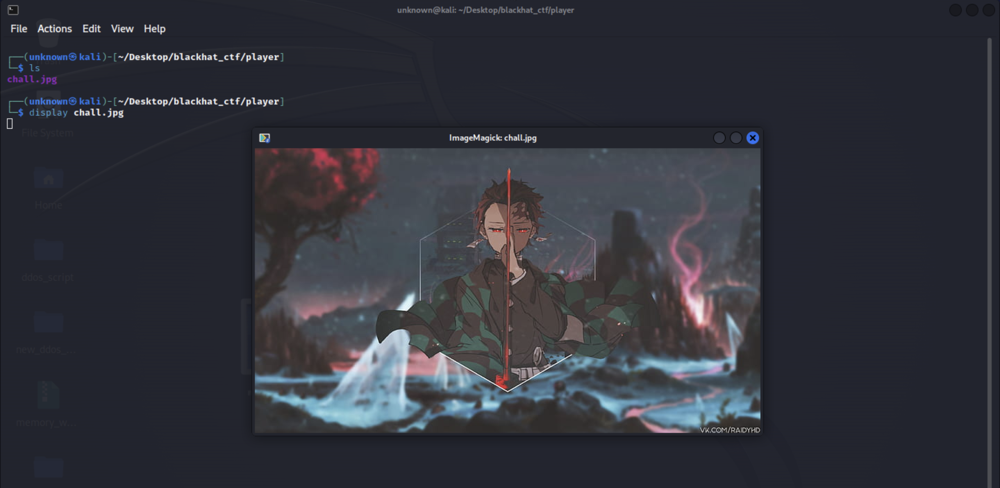

2. Use the `file chall.jpeg` command to gather more information about the file. This command reveals a secret note containing a URL to a website.

    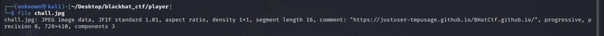

3. Access the provided URL, which leads you to a news article discussing a person named 'Jacksmp' whose data has been leaked. Pay attention to the text at the bottom of the website, which mentions finding more data somewhere.

    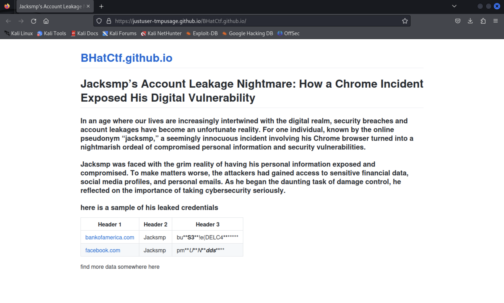

4. The text "find more data somewhere here" was not clickable, it could be a mistake by the website developer. This means that the data is somewhere within the database of the website. Since the website is hosted on GitHub Pages, navigate to the repository of the website to search for the additional information.

    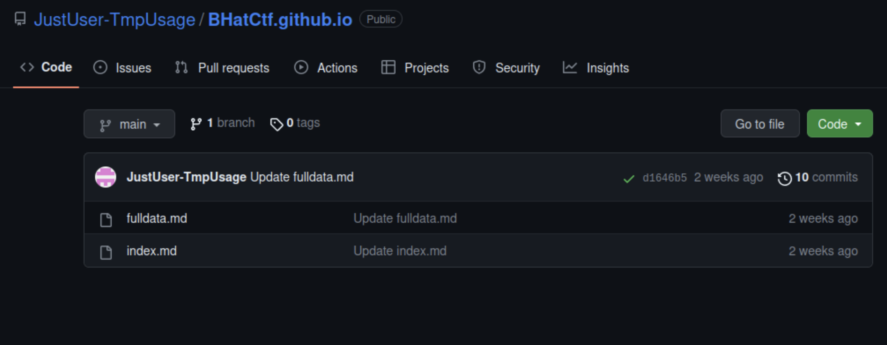

5. Within the repository, locate a link that leads to the data. Click on the link, which redirects you to a pastebin containing credentials for Jacksmp's accounts. Note that only one password works.

    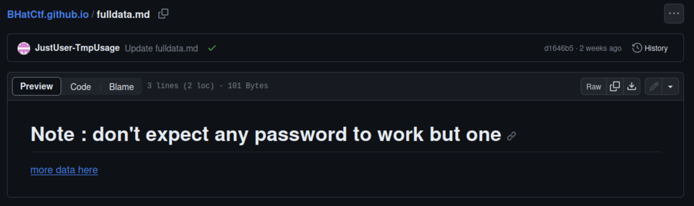

6. Considering the reference to the "mega" as a key for a file, use the provided encrypted key to access and download a file named `Google.7z`.

    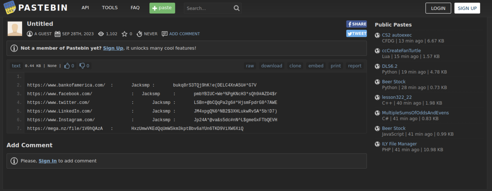
    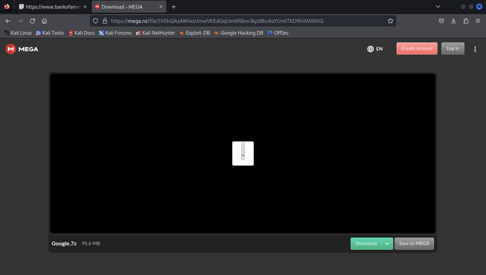

7. Extract the files from the `Google.7z` archive and begin inspecting them. It is possible that this file is the one that was leaked and led to the exposure of Jacksmp's credentials. During the analysis, this is Jacksmp's Chrome user data file. Explore and examine its contents thoroughly.

    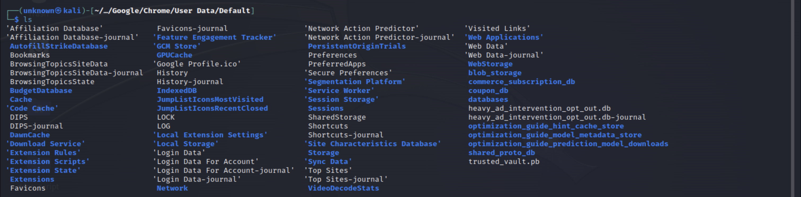

8. Within the Chrome user data file, identify a suspicious Chrome extension with the ID "mmkhenhkkigaomljmmnkadejchchgoma". This extension contains a JSON file and an obfuscated JavaScript code.

    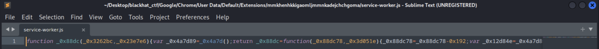

9. Utilize a deobfuscation tool to decode the JavaScript code and make it readable. Analyze the deobfuscated code to identify three strings that appear to be encrypted text.

    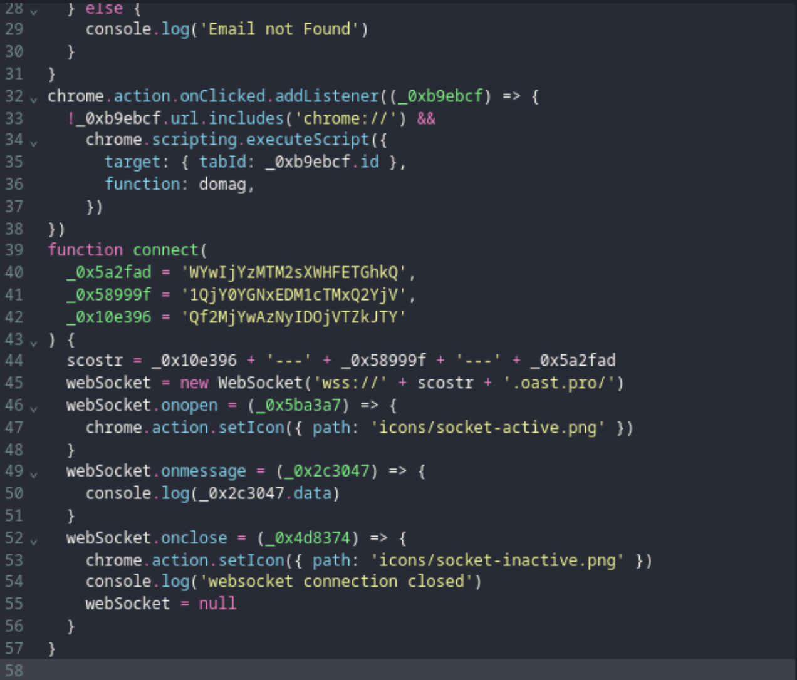

10. Attempt to decrypt the encrypted strings using techniques such as base64 decoding. Base64 decoding did not yield readable output, consider exploring other decryption methods or combinations.

    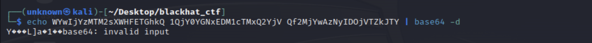

11. Try to manipulate the strings and use different combinations until you get readable text. You may accomplish that by develop a bash script that automates the process of decoding different variations and combinations of the strings.

    [Here is the script I wrote to solve this challenge](./combinations.sh)

    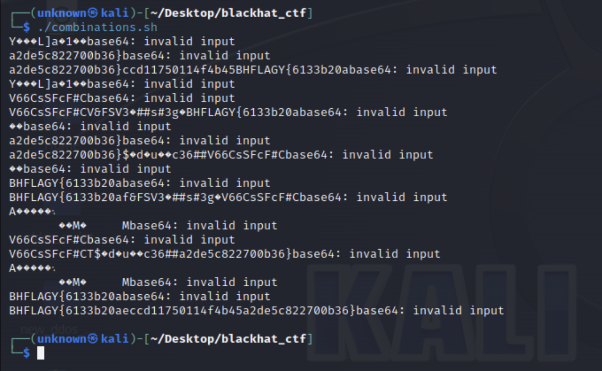

12. One of the decrypted combinations is the flag.

Good luck!