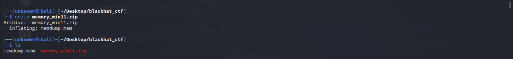
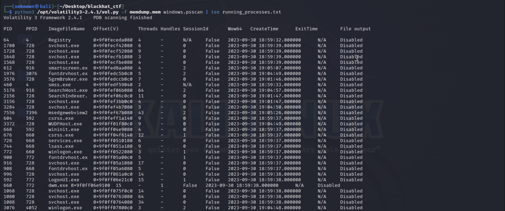
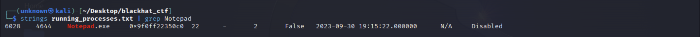
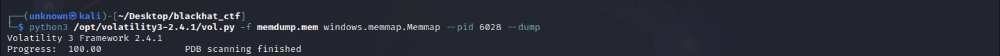
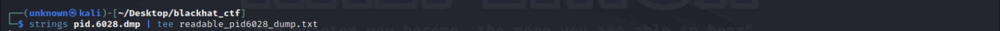
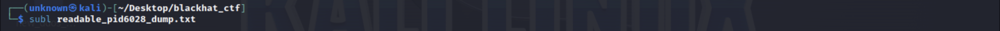
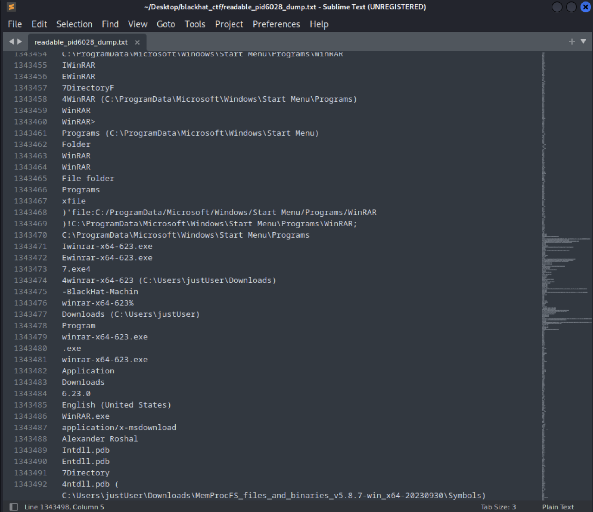
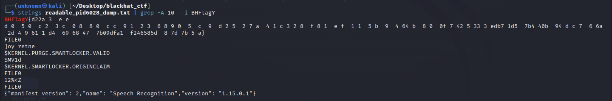

# Forensics Challenge: Not Supported

Welcome to the qualification rounds of the Blackhat MEA CTF! Get ready to put your forensic skills to the test in the "Not supported" challenge. Can you uncover the hidden flag and prove your mastery in memory analysis?

## Challenge Description

In this intriguing challenge, you will dive into the depths of a memory dump to extract a flag. But beware, things are not as straightforward as they seem. The flag is cunningly concealed within the running Notepad process, the flag should be submitted without the BHFlagY{} tag. Are you up for the challenge?

**Dificulty:** Medium

## Challenge Steps

To conquer the "Not supported" challenge, follow these steps with precision:

1. **Download the Challenge Files:** Begin by downloading the zip file from Flagyard. Within this enigmatic package, a text file holding a URL that leads you to the memory dump file.

    

2. **Prepare Your Toolkit:** Arm yourself with the powerful Volatility 3 memory forensics tool tool, a trusted companion in the realm of memory analysis. Install it using the command:
 
 
    `sudo git clone https://github.com/volatilityfoundation/volatility3.git`.

3. **Uncover the Running Processes:** By using the command `python3 vol.py -f memdump.mem windows.psscan | tee running_processes.txt` a process scan will start and reveal a table of processes, and as good practice, store the output of the running proccesses in a file for reference and back-up. In this case, the processes scan will be stored in 'running_processes.txt'
    
 

4. **Retrieve the Notepad Process:** Start your quest to find the elusive Notepad process within the running processes. Use the command `strings running_processes.txt | grep Notepad` to extract the Process ID (PID). This number represents the unique proccess number of the Notepad.exe process.

    

5. **Extract the Essence of Notepad.exe:** To extract the memory related to the Notepad process, the command `python3 vol.py -f memdump.mem windows.memmap.Memmap --pid 6028 --dump` will dump the memory of the Notepad.exe and store it in the file 'pid.6028.dmp'.

    

6. **Reveal the Concealed Semantics:** As the dump file is not readable itself since it's in binary use the command `strings pid.6028.dmp | tee readable_pid6028_dump.txt` to transform and extract readable strings  from the binary file and store it in 'readable_pid6028_dump.txt'.
 
    

7. **Inspect the Process's Memory:** You are now able to view the dumped process memory using the 'readable_pid6028_dump.txt' with your trusted text editor. The flag should be in this file between millions of strings.
     
 
    

8. **Flag extraction:** Search for the flag using the command `strings readable_pid6028_dump.txt | grep -A 10 -i BHFlagY`. You should see the flag inside "BHFlagY{ }".
    

9. **Claim Your Victory:** You have successfully extracted the flag from the depths of the Notepad process. You are now one step closer to proving your forensic expertise in the Blackhat MEA CTF.
 
    **Flag:** `d22a3eeed0590c23c0880cc91236905c9d2527a41c328f81ef115b964b800f7425333edb71d57b440b94dc76a2d496111d46968477b09dfa1f246585d87d7b5a`

Good luck!
