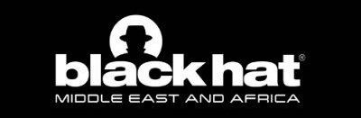

# Blackhat-MEA-2023-CTF-Writeups

This repository contains writeups for the Blackhat 2023 Capture the Flag (CTF) challenges. The CTF challenges are designed to test and enhance your skills in various areas of cybersecurity. Each challenge presents a unique scenario and requires you to solve a series of Web Penetration Testing, Reverse Engineering, Digital Forensics, Cryptography and Binary Exploitation (PWN) challenges.

## Challenges

- **Not Supported**
  - Description: Straight forward challenge, the flag is written on running notepad process. Flag is direct without BHFlagY{} tag.
  - Difficulty: Medium
  - Points: 150
  - Category: Forensics
  - Writeup: [Not Supported Writeup](./Not_Supported/README.md)
  

- **USB100**
  - Description: In a shocking turn of events, a malicious actor managed to gain physical access to our victim's computer by plugging in a rogue USB device. As a result, all critical data has been pilfered from the system. Flag is direct without BHFlagY{} tag.
  - Difficulty: Easy
  - Points: 50
  - Category: Forensics
  - Writeup: [USB100 Writeup](./USB100/README.md)
  

- **What am I?**
  - Description: Can you figure out what type of file this is?!?
  - Difficulty: Easy
  - Points: 50
  - Category: Reverse Engineering
  - Writeup: [What Am I? Writeup](./What_Am_I?/README.md)
  

- **Can you break the armor?**
  - Description: Can you beat this awesome armor?
  - Difficulty: Medium
  - Points: 180
  - Category: Reverse Engineering
  - Writeup: (Comming Soon!)
  

- **Authy**
  - Description: I have just learned Golang and trying to build a small authentication platform with it. It's a simple API so it should be secure right?
  - Difficulty: Easy
  - Points: 100
  - Category: Web
  - Writeup: (Comming Soon!)