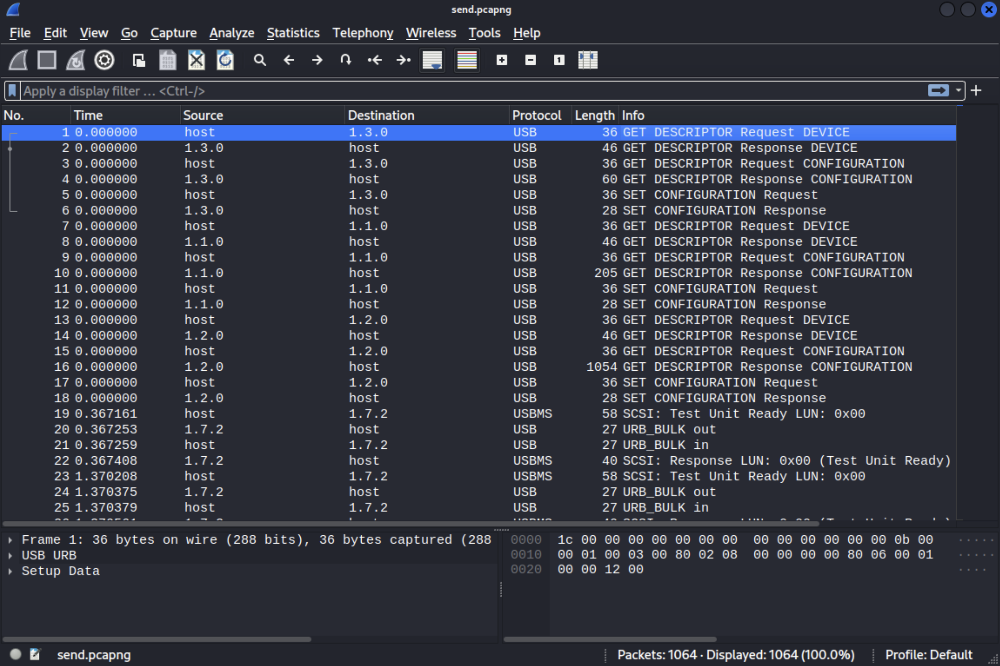
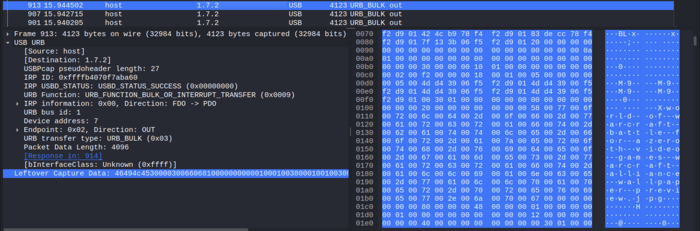
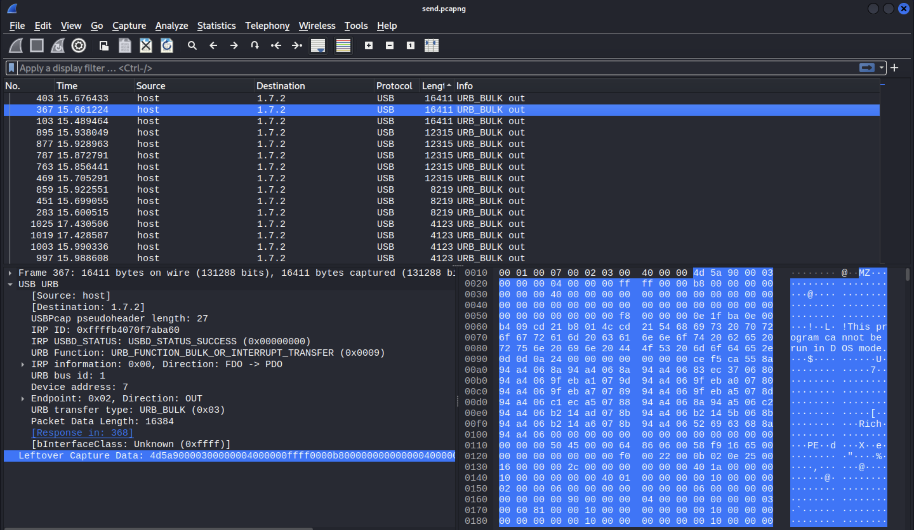
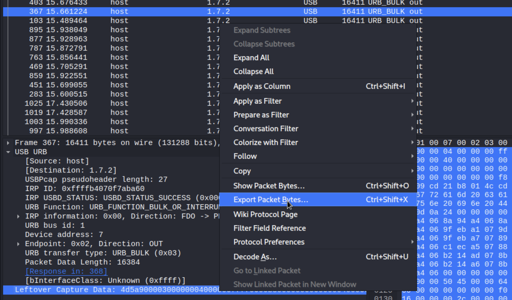
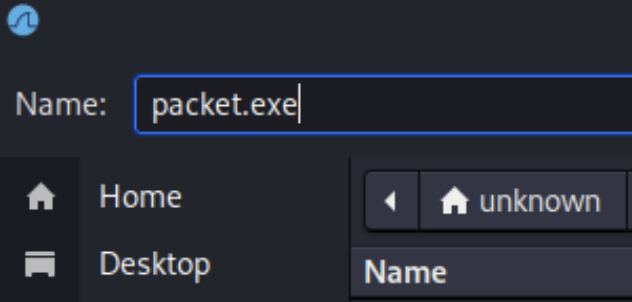
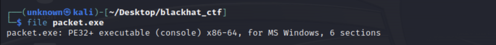
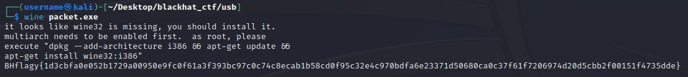

# Forensics Challenge: USB100

Welcome to the qualification rounds of the Blackhat MEA CTF! Get ready to put your forensic skills to the test in the "USB100" challenge. In this challenge, you will showcase your skills in analyzing packet captures and uncovering critical information to retrieve the stolen flag.

## Challenge Overview

In a shocking twist of events, an intruder has managed to gain physical access to our victim's computer by exploiting a vulnerable USB port. As a result, all critical data has been stealthily stolen from the system, leaving behind a trail of encrypted packets for you to analyze. Your mission, is to use your USB forensics skills to retrieve the stolen flag.

## Challenge Steps

1. **Analyzing the Packet Capture**: The first step in your investigation is to examine the provided PCAP file using Wireshark. Launch Wireshark and load the PCAP file to begin the USB analysis.

    

2. **Searching for Large Packets**: Focus your attention on packets that contain a substantial amount of data. Sorting the packets by size will assist you in identifying those that are most likely to harbor the stolen information. Click on the "Length" column to sort the packets accordingly.

3. **Unveiling the Leftover Capture Data**: With your focus now honed in on the packets of interest, dive deeper into their contents. Select a packet and click on "Leftover Capture Data". By doing so, you will highlight the corresponding section within the data bytes pane of Wireshark.

    

4. **Seeking the Executable Files**: You must now search for any intriguing files transmitted by the USB device. Executable files often possess a distinctive characteristic ─ they start with "MZ" at the beginning of the "Leftover Capture Data" segment. Go over the packets one by one untill you find the executable.

   

5. **Extracting the Executable**: Once you have successfully identified the packet containing the executable file, it is time to extract it. Right-click on the "Leftover Captured Data" and select the Export packet option and name it "packet.exe".

    

    

    

6. **Verifying the File Type**: To confirm the file type, use the command `file packet.exe` "PE32+" means that the file is an x86-64 bit executable. If you are using an ARM machine, you may not be able to execute it.

    

7. **Revealing the Flag**: To run windows executables on linux, use the command `wine packet.exe`. That will run the executable and display the flag on the terminal console.

    

    *For windows users use the command `./packet.exe` to run the executable in CMD.

**Note**: The flag should be submitted without the BHFlagY{ } tag.

Good luck!