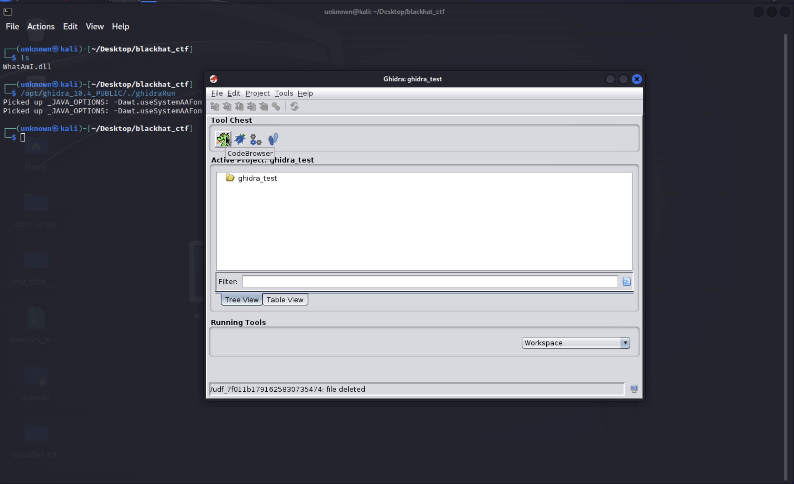
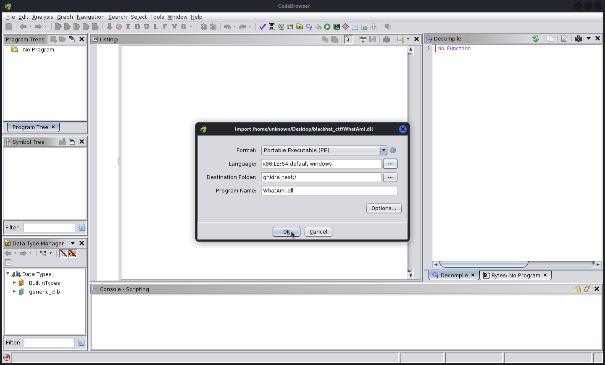
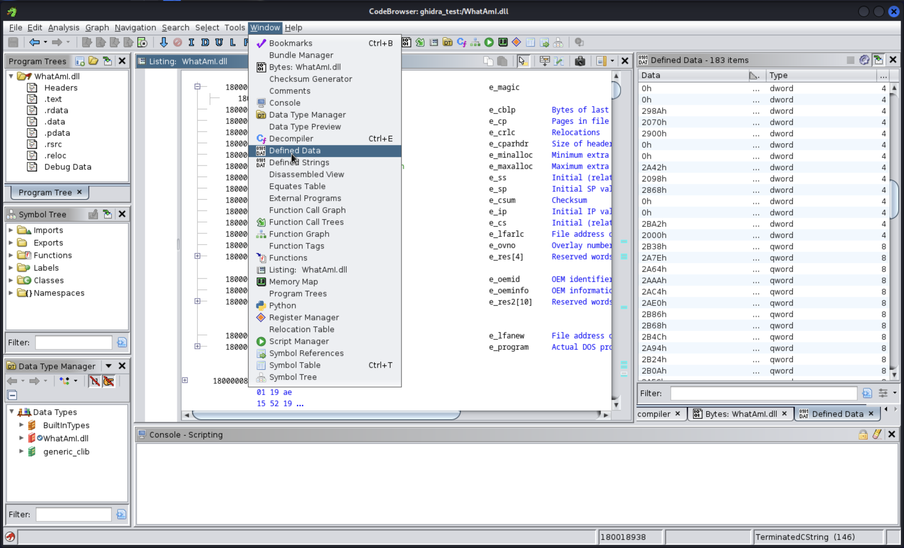
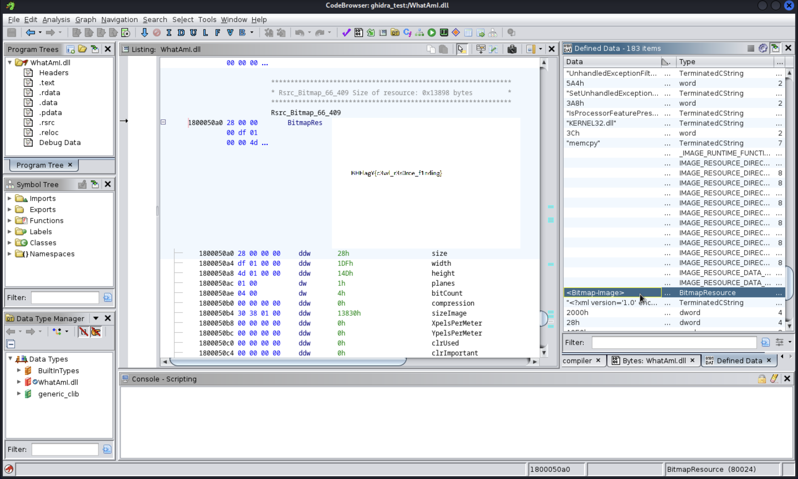
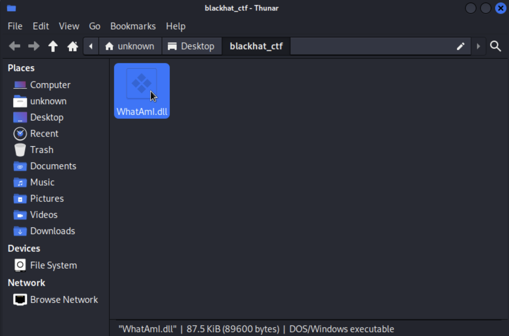
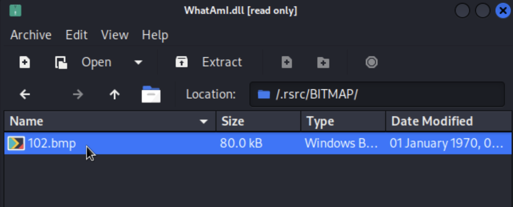
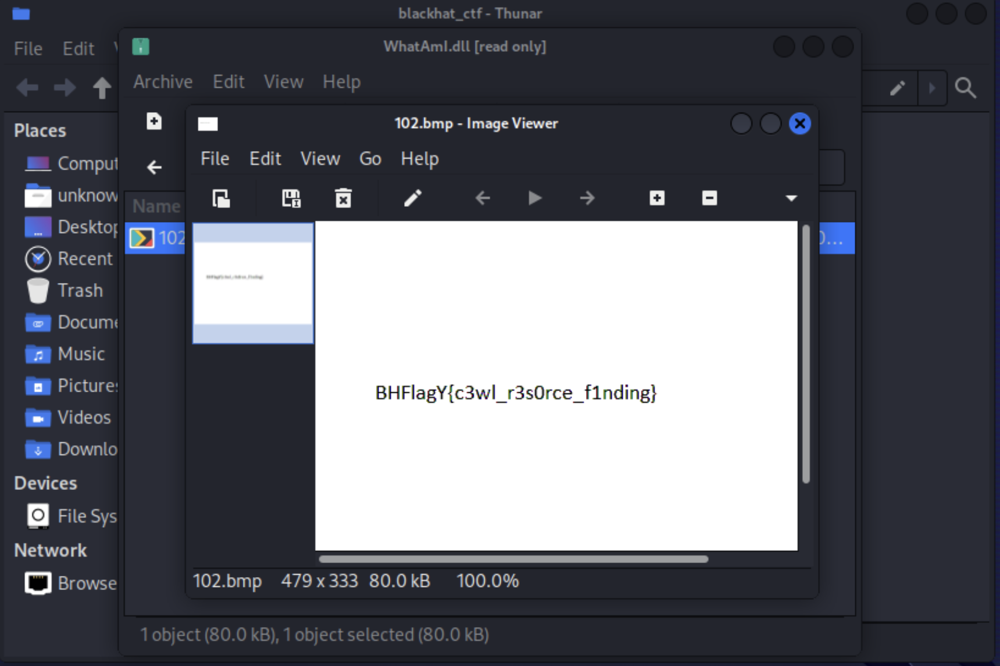
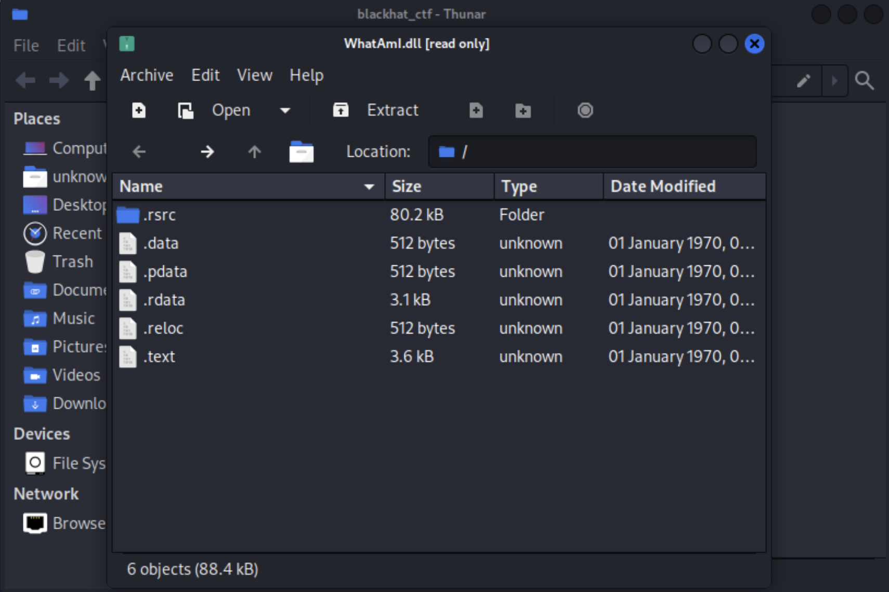

# Reverse Engineering Challenge: What am I?

## Challenge Description

Welcome to the qualification rounds of the Blackhat MEA CTF! In this challenge, your task is to figure out the type of file provided. Can you unravel the mystery and discover what it truly is?

## Challenge Steps

1. Extract the WhatAmI.dll file from the zipped folder.

2. Run Ghidra to reverse engineer the DLL.

    

3. Import the .dll file to Ghidra.

    

4. Navigate to the window drop-down menu and click on "Defined Strings" and "Defined Data" to display the strings and data defined in this DLL file.

    

5. Start going over the defined strings to see if the flag is a defined string in the file or if there is any indicator that might lead you to the flag.

6. During the inspection of the defined data, you will notice that there is a Bitmap inside this DLL. Click on it to navigate to the part of the DLL that contains the bitmap image.

    

7. The image contains the flag written on it.

8. This means that the DLL could be opened as an archive containing the flag. The trick here is that some DLLs can be treated as archives.

9. Open the folder containting the DLL, on windows, right click the file, navigate to 7zip and click on open archive. If you are using Linux, simply double-click on the file.

    

10. Inspect the contents of the archive and look for the bitmap file.

11. Navigate to the directory named ".rsrc/BITMAP". Here, you will find the "102.bmp" file.

    
    
    

12. Open the "102.bmp" bitmap file using an image viewer to read the flag clearly.

    

## Challenge Notes

- This challenge is simple, it aims to test your ability to identify the different file types and understand what are DLL files and how do they work.

Good luck!