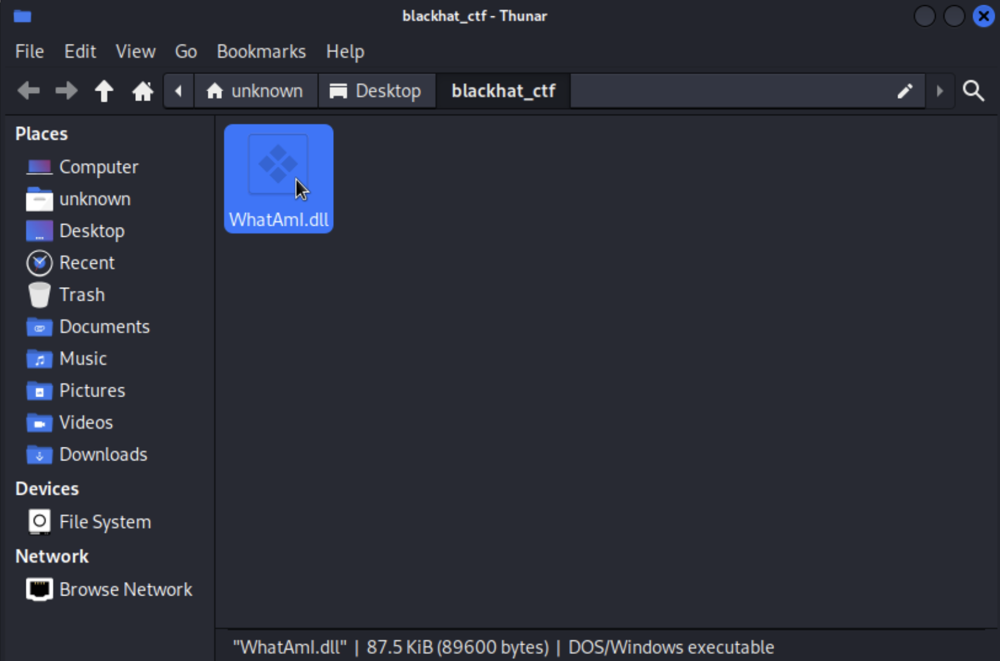
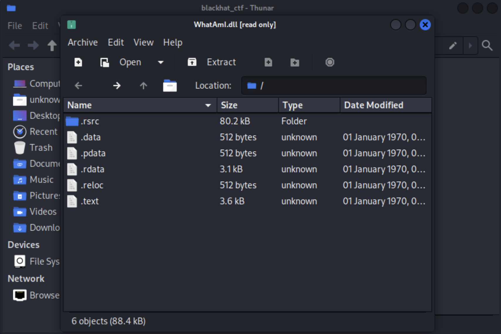
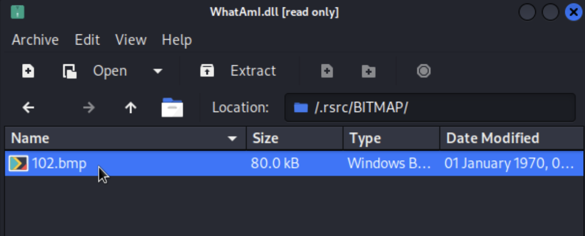
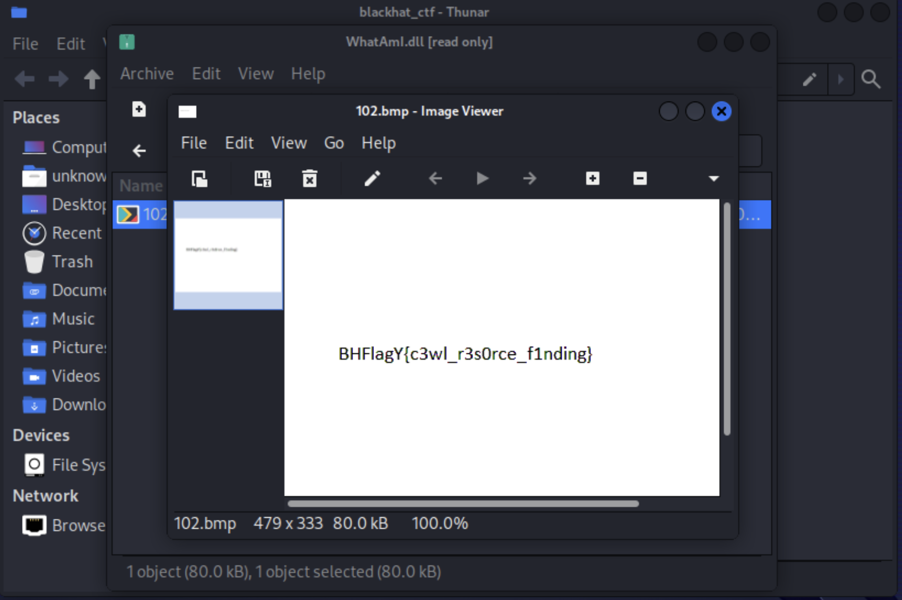

# Reverse Engineering Challenge: What am I?

## Challenge Description

Welcome to the qualification rounds of the Blackhat MEA CTF! In this challenge, your task is to figure out the type of file provided. Can you unravel the mystery and discover what it truly is?

## Challenge Steps

1. Download the provided file named "WhatAmI.dll".

2. DLL files can be opened as archives to explore their contents. On windows, right click the file, navigate to 7zip and click on open archive. If you are using Linux, simply double-click on the file.

    

3. Inspect the contents of the archive.

    

4. Navigate to the directory named ".rsrc/BITMAP" within the extracted contents. Here, you will find the desired "102.bmp" file.

    

5. Open the "102.bmp" bitmap file using an image viewer or editor of your choice. You will discover that it contains the flag, which is the ultimate goal of this challenge.

    

## Challenge Notes

- This challenge is simple, it aims to test your ability to identify the different file types and understand what are DLL files and how do they work.

Good luck!